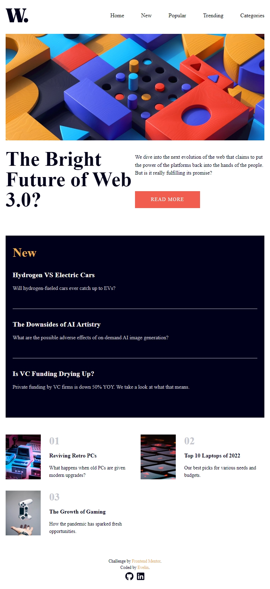

 
  <h1>News Website</h1>

 
  
   
  
  
  
  
  

## Description

This project is a responsive news website built with React and Tailwind CSS. It features a main article section, a news container with the latest articles, and a popular articles section. The website is designed to be fully responsive, providing an optimal viewing experience across a wide range of devices.

## Key Features

- Main Article Section: Highlights the most important news article.

- News Container: Displays the latest news articles.

- Popular Articles: Showcases the most popular articles.

- Responsive Design: Ensures the website looks great on all devices.

## Screenshots

  
    
   
     
   
    
   

## Additional Information

- Icons used in the project are sourced from [svgrepo.com](https://www.svgrepo.com/) and [react icons](https://react-icons.github.io/react-icons/).
- Challenge by [Frontend Mentor](https://www.frontendmentor.io).

Check out the live project: [News Website](https://news-homepage-bay-eight.vercel.app/)
